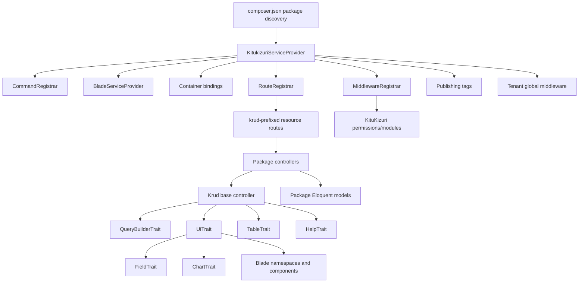
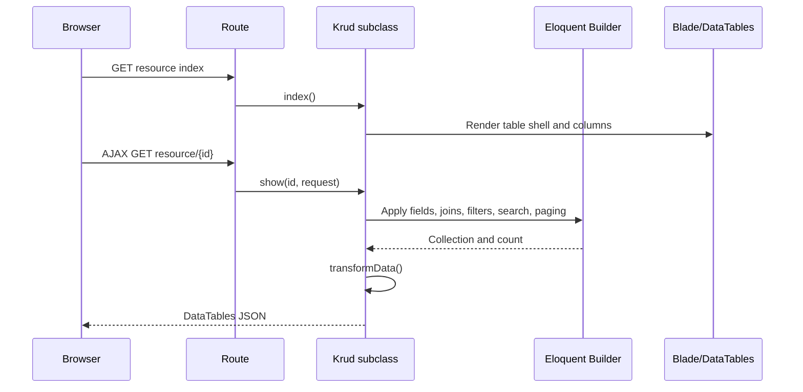

# Architecture

This document describes the analyzed `kitukizuri-master` snapshot. Source code remains authoritative.

## Component map



## Package discovery

`composer.json` declares:

```json
{
  "extra": {
    "laravel": {
      "providers": [
        "Icebearsoft\\Kitukizuri\\KitukizuriServiceProvider",
        "Icebearsoft\\Kitukizuri\\App\\Providers\\PostgresGrammarProvider",
        "Icebearsoft\\Kitukizuri\\App\\Providers\\ForceHttpsProvider"
      ],
      "aliases": {
        "Kitukizuri": "Icebearsoft\\Kitukizuri\\KituKizuri",
        "Krud": "Icebearsoft\\Kitukizuri\\Krud"
      }
    }
  }
}
```

The main service provider also registers the same aliases in `boot()`. New application code should prefer explicit imports so behavior does not depend on alias boot timing.

## Main service provider

`src/KitukizuriServiceProvider.php` performs these actions:

### `register()`

- Registers `CommandRegistrar`.
- Registers `BladeServiceProvider`.
- Registers `Tenant` as a singleton.
- Binds `kitukizuri` as a singleton returning `new KituKizuri`.

### `boot()`

- Pushes `Tenant` into the global HTTP kernel.
- Registers middleware aliases.
- Registers package routes.
- Registers `Kitukizuri` and `Krud` aliases through `AliasLoader`.
- Registers publishable resources.

## Krud controller architecture

`src/Krud.php` extends the host application's `App\Http\Controllers\Controller`. This is an important package boundary: the package expects that class to exist in the consuming Laravel application.

The controller is stateful during request construction. Typical constructor calls mutate:

- Model and query builder state.
- Field metadata.
- UI title, layout, templates, buttons, and view type.
- Parent relation metadata.
- Query joins, filters, grouping, and ordering.
- Validation rules and post-save hooks.

The resource methods consume that state to render views, query data, save records, and delete records.

## HTTP route architecture

The route prefix is `config('kitukizuri.routePrefix')`, defaulting to `krud`.

The internal route group uses:

```php
[
    'prefix' => $prefix,
    'namespace' => 'Icebearsoft\\Kitukizuri\\App\\Http\\Controllers',
    'middleware' => ['web', 'auth', 'kitukizuri', 'kmenu'],
]
```

Registered routes include:

| URI/resource | Controller | Scope |
|---|---|---|
| `/` | `DashboardController@index` | Dashboard |
| `roles` | `RolesController` | Resource |
| `modulos` | `ModulosController` | Resource |
| `usuarios` | `UsuariosController` | Resource |
| `asignarpermiso` | `UsuarioRolController` | Resource |
| `permisos` | `PermisosController` | `index`, `store` |
| `rolpermisos` | `RolesPermisosController` | `index`, `store` |
| `empresas` | `EmpresasController` | Resource |
| `sucursales` | `SucursalesController` | Resource |
| `moduloempresas` | `ModuloEmpresasController` | Resource |
| `database` | `DataBaseController` | Resource |
| `logs` | `LogController` | Resource |
| `personalizacion` | `PersonalizacionController` | `index`, `store` |

The route registrar uses string controller names and a namespace group. Verify this behavior during framework upgrades.

## Middleware

### `Tenant`

Pushed globally. If `kitukizuri.multiTenants` is not exactly `true`, it passes through. When enabled, it:

1. Resolves the tenant from `HTTP_HOST`.
2. Replaces runtime MySQL and MongoDB connection configuration.
3. Purges and reconnects the database manager.
4. Loads the latest `Empresa` into session.

### `kitukizuri`

Alias for `KituKizurimd`. It:

1. Redirects guests to `/login`.
2. Calls `KituKizuri::validar()` for company/module access.
3. Calls `KituKizuri::permiso()` for route permission.
4. Aborts with HTTP 401 when either check fails.

### `kmenu`

Builds the menu through `MenuController` and stores it in session.

### `klang`

Sets the application locale from session or `Auth::user()->defalut_lang`.

## Views

`BladeServiceProvider` registers four namespaces:

| Namespace | Directory |
|---|---|
| `krud` | `src/resources/views/krud` |
| `kitukizuri` | `src/resources/views/kitukizuri` |
| `krud_prev` | `src/resources/views/krud_prev` |
| `kitukizuri_prev` | `src/resources/views/kitukizuri_prev` |

The package uses both namespaced package views and consuming-application views such as `krud.index`, `krud.edit`, `krud.calendar`, and `krud.chart`, depending on route prefix and UI mode.

## Data flow for a table view



## Persistence flow

`store()`:

1. Decrypts the submitted `id`.
2. Validates accumulated field rules.
3. Loads the existing model when editing.
4. Ignores request keys that do not correspond to defined fields.
5. Normalizes supported types.
6. Applies parent values.
7. Saves the model.
8. Synchronizes supported relation-table values through `SelectValues`.
9. Runs registered store callbacks.
10. Flashes a message and redirects.

This is not a mass-assignment flow; fields are assigned individually based on the field metadata.

## Publishing

The provider maps package directories to application directories through named tags. `krud:update` separately implements a synchronization routine that can replace selected files after creating `_old` backups.

## Package boundaries and undeclared integrations

The snapshot references integrations not declared in the root Composer requirements, including framework components, Livewire, MongoDB Laravel, Laravel Prompts, LDAP-related stubs, and application classes. Treat these as environment assumptions until dependency constraints and automated tests explicitly define them.
